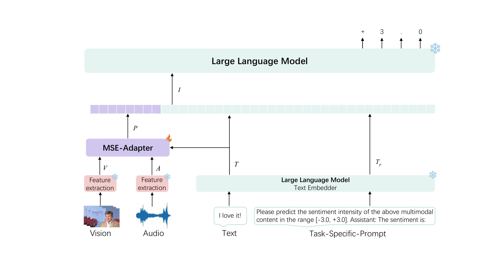

# 🌟 The Official Implementation of MSE-Adapter

🎉 We have been accepted at AAAI-2025!

This is the official code for the 《MSE-Adapter: A Lightweight Plugin Endowing LLMs with the Capability to Perform Multimodal Sentiment Analysis and Emotion Recognition》 [](https://arxiv.org/abs/2502.12478)
[](https://ojs.aaai.org/index.php/AAAI/article/download/34755/36910)


*Fig1: The comprehensive framework integrating MSE-Adapter with LLM.*

## 🚀 Get Started! (Take MSE-ChatGLM3-6B as an example.)

### 🔧 Step 1: Create the Environment
``` bash
git clone https://github.com/AZYoung233/MSE-Adapter.git
cd MSE-Adapter
conda create --name MSE-Adapter python=3.10.13
conda activate MSE-Adapter
pip install -r requirements.txt
```

### 📂 Step 2: Download the Dataset
- You can download the dataset at the link below：
   - [MOSEI](https://huggingface.co/datasets/AZYoung/MOSEI_processed)📦
   - [SIMS-V2](https://huggingface.co/datasets/AZYoung/SIMSV2_processed)📦
   - [MELD](https://huggingface.co/datasets/AZYoung/MELD_processed)📦
   - [CHERMA](https://huggingface.co/datasets/AZYoung/CHERMA0723_processed)📦
- Place them under the same folder, and set `root_dataset_dir` in `parse_args` of `run.py` to the path where you store your dataset.

### 💾 Step 3: Download the Backbone LLM
- Download backbone LLM from the [THUDM/chatglm3-6b](https://huggingface.co/THUDM/chatglm3-6b) and set `pretrain_LM` in `parse_args` of `run.py` to the path where you store your LLM. If for any particular reason your download is too slow, try using [Modelscope](https://modelscope.cn/my/overview) 🌐 or [HF-mirrors](https://hf-mirror.com/) 🌐.

### ▶️ Step 4: Run!
- Once you have completed the basic setup as described above, you can run the code using the following steps. The code will run 5 random seeds and the results will be saved in `results/result`. The results presented in the paper are the average of 5 random seeds.
```bash
cd MSE-ChatGLM3-6B
python run.py
```

## 🙏 Acknowledgment
Our code is structurally referenced to [SELF-MM](https://github.com/thuiar/Self-MM). Thanks to their open-source spirit for saving us a lot of time. 💖